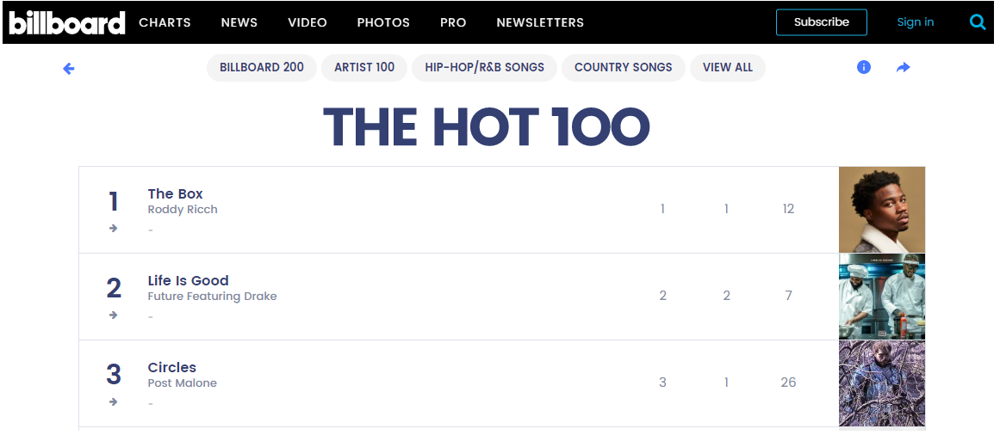

<a href="https://www.billboard.com/charts/hot-100"></a>

# Analyzing Trends of Music Lyrics and Features Throughout the Decades

## Problem
Analyzing the most popular songs of the last decades and understanding how the songs change throughout the
years in terms of genres, features, generations, lyrics, etc.

## Summary
The main goal of this project is to understand and analyze how the most popular songs change throughout
the years. Starting from the 1960s, we focused on each year’s the most popular songs and try to answer
questions such as:
- How do the most frequent words in the songs change with decades?
- How do popular genres change throughout the years?
- Can we explain these changes by the sociopolitical status of the related era? How are these
changes related to real life?

The real-world application of this project is: it can help us understand the music trends and the changes in genres better. Also, it can provide some insights for other people who are in need to do feature extraction, model training, and recommendation systems in this field, etc.

In conclusion, this project looks for relations between genres, intertextual connections, acoustic
phenomena (track features), and the time.

## Methodology
> We created our dataset using Billboard, Lyrics Genius, and Spotify APIs. (More details in the next section.)

> Cleaned the data, removed corrupted data-lyrics.

> Conducted preliminary data analysis, recognised the data and explored some fun facts

> Analyzed the most popular songs of the last decades

> Understood how the songs change throughout the years in terms of genres, features, generations, lyrics, etc. 

> Found trends, changes, and interesting facts about the world's music taste in the last 60 years.

---

## Data Source
In this project, our analyses are based on Billboard Hot 100 charts of the years between 1960-2020. 
We also analyzed lyrics and song characteristics. To build our dataset we used these Python packages:

- billboard
	
- lyricsgenius
	
- spotipy

Using the python packages we have built our dataset from the scratch. We first pulled the data for the Billboard Hot 100 list. Then we merged lyrics data using LyricsGenius API. Finally, we merged Spotify features to our main data using spotipy Python API.

---

## Installation

```shell
$ pip3 install billboard.py
```

```javascript
import lyricsgenius
from spotipy.oauth2 import SpotifyClientCredentials

#Connect to LyricsGenius
genius = lyricsgenius.Genius("Your_ID_goes_here")

#Connect to Spotify API
client_credentials_manager = SpotifyClientCredentials(client_id=client_id, client_secret=client_secret)
sp = spotipy.Spotify(client_credentials_manager=client_credentials_manager)

#setup nltk library
import nltk
nltk.download('wordnet')
nltk.download('stopwords')
```

---

## Codes:

### Project Jupyter Notebook:
- [Final_Plots.ipynb](../master/Final_Plots.ipynb) : A summary of the plots

### Data Extraction and Preparation:
 - [c_01_data_data_extract.py](../master/source_codes/c_01_data_data_extract.py) : Get Billboard Hot 100 and Lyrics Genius Data
 - [c_02_data_spotify_song_features.py](../master/source_codes/c_02_data_spotify_song_features.py) : Get Spotify song features using Billboard hotlist
 - [c_03_data_combine_hotlist_and_spotify.py](../master/source_codes/c_03_data_combine_hotlist_and_spotify.py) : Combine Billboard and Spotify data
 - [c_04_data_dataprep_genre_sentiment.py](../master/source_codes/c_04_data_dataprep_genre_sentiment.py) : Extract genres, create genre mapping, create sentiment feature

### Analysis:
 - [c_05_analysis_hotlist_analysis.py](../master/source_codes/c_05_analysis_hotlist_analysis.py) : Analysis on our raw data, understanding the data
 - [c_06_analysis_artist_popularity.py](../master/source_codes/c_06_analysis_artist_popularity.py) : Analysis of artist popularities
 - [c_07_analysisfun_fact_syp.py](../master/source_codes/c_07_analysisfun_fact_syp.py) : Some fun facts about the dataset
 - [c_08_analysis_get_top_genre.py](../master/source_codes/c_08_analysis_get_top_genre.py) : A basic analysis on genres
 - [c_09_analysis_genreacous.py](../master/source_codes/c_09_analysis_genre.py) : Functions to plot song features
 - [c_10_analysis_generation_wordcloud.py](../master/source_codes/c_10_analysis_generation_wordcloud.py) : Wordclout plots for different decades
 - [c_11_analysis_genre_sentiment_analysis.py](../master/source_codes/c_11_analysis_genre_sentiment_analysis.py) : Plots about genres in years-decades

### Plot Snippet:


---

## Required Packages:
> billboard
> pandas
> lyricsgenius
> numpy
> spotipy
> os
> re
> difflib
> sys
> csv
> langdetect
> nltk
> string
> collections
> matplotlib
> itertools
> vaderSentiment
> textblob
> newspaper
> sklearn
> plotly
> wordcloud
> math

To install these packages, you can use pip install packages. For example,

```javascript
pip install pandas
```

---

## Contributors
| <a href="https://github.com/FrancisBian" target="_blank">**Yucheng Bian**</a> | <a href="https://github.com/Eva-SiyiW" target="_blank">**Siyi Wang**</a> | <a href="https://github.com/ShYuPe" target="_blank">**Yuepeng Shen**</a> | <a href="https://github.com/iocak28" target="_blank">**Ismail Ocak**</a> |
| :---: |:---:| :---:| :---:|
| [](https://github.com/FrancisBian)    | [](https://github.com/Eva-SiyiW) | [](https://github.com/ShYuPe)  | [](https://github.com/iocak2)    |
| <a href="https://github.com/FrancisBian" target="_blank">`github.com/FrancisBian`</a> | <a href="https://github.com/Eva-SiyiW" target="_blank">`github.com/Eva-SiyiW`</a> | <a href="https://github.com/ShYuPe" target="_blank">`github.com/ShYuPe`</a> | <a href="https://github.com/iocak28" target="_blank">`github.com/iocak28`</a> |

---

## Support
Reach out to us at one of the following places!
- email to 'y 2 b i a n at u c s d   e d u'
- email to 'i o c a k 2 8 at g m a i l   c o m'
